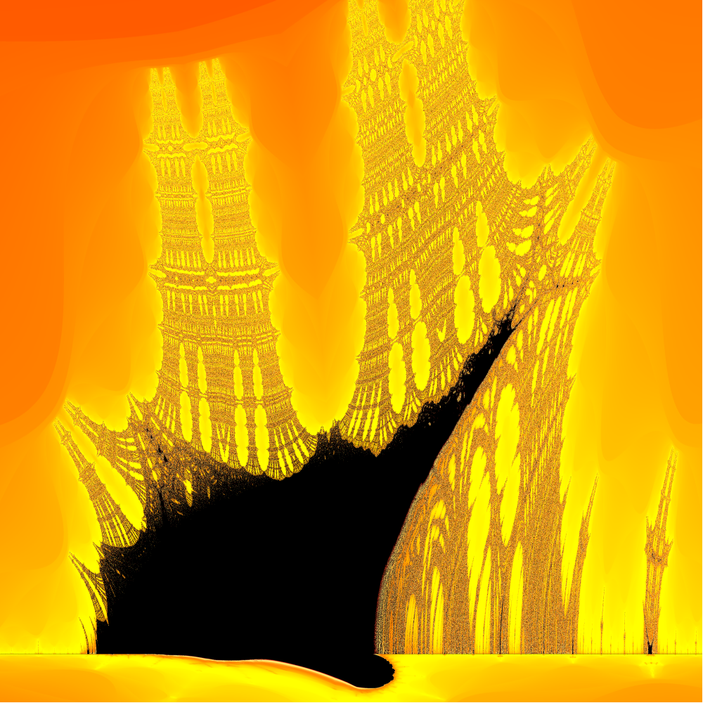
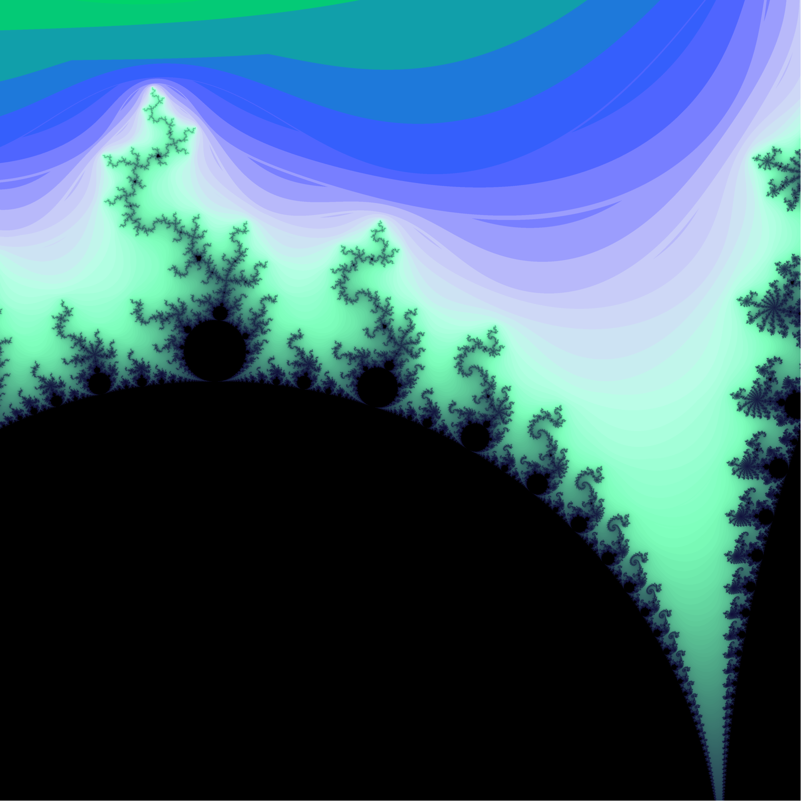

# Fractal-Explorer

## A graphical explorer for escape-time fractals, written in Java (UI with JavaFX).

### Main features:

- *multithreaded*
- *basic canvas interations*
- *history of interations*
- *choose from a preloaded palette or build your own with spline interpolation*
- *different fractal families: Mandelbrot,Multibrot,Julia,Burning Ship, Newton's*
- *2 escape-based coloring algorithms (basic and smoothed)*
- *export the image in different resolutions and supersampling*

